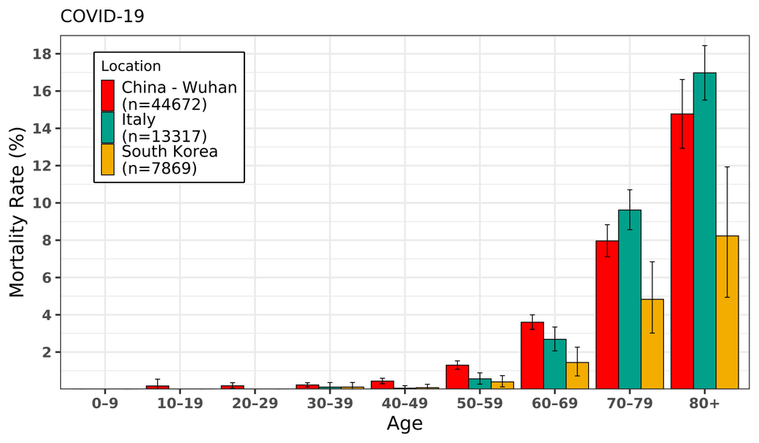
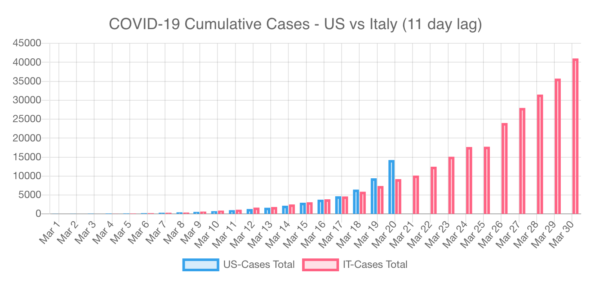

### Data

[Death rate by age](https://www.reddit.com/r/dataisbeautiful/comments/fj0eef/oc_coronavirus_death_rate_by_age_italy_vs_china) (March 15, 2020)

---

[COVID-19 US vs Italy (11 day lag)](https://www.reddit.com/r/dataisbeautiful/comments/flvoev/oc_covid19_us_vs_italy_11_day_lag_updated/) (March 20, 2020)

---

**Case Trackers**

 * [The Covid Tracking Project](https://covidtracking.com/) is an incredible resource for US Data as well as [state-level links](https://covidtracking.com/data/) directly to each state's COVID-19 page. The project also has spreadsheets available, and a [public API](https://covidtracking.com/api/) that provides results in JSON or CSV format. I use this API (or really, your browser uses it) in my [Coronavirus Statistics](http://www.codercowboy.com/coronasim/data.html) tool. (Thanks Demi!)
 * [My Coronavirus Statistics Tool](http://www.codercowboy.com/coronasim/data.html) provides a detailed breakdown of the numbers provided by [the Covid Tracking Project's API](https://covidtracking.com/api/). It shows numbers at the US level and state level that are difficult to find easily elsewhere, such as the day to day increase percentage of new confirmed cases and hospitalizations. It also shows the percentage of hospitalizations compared to the number of confirmed cases.
 * [Global cases tracker by Johns Hopkins University (JHU)](https://coronavirus.jhu.edu/map.html) (Thanks Daniel!)
 * [Worldometer's Global CoronaVirus Tracker](https://www.worldometers.info/coronavirus/), and their [state-level tracker](https://www.worldometers.info/coronavirus/country/us/)
 * [ncov2019.live](https://ncov2019.live/) is an incredible tracker made by a teenager. [Buy him coffee.](https://www.reddit.com/r/Portland/comments/fmjcjz/go_buy_this_17_yo_a_coffee_he_set_up_a_website/)
 * [Informal COVID-19 Case Map](https://covidmap.global/) by [r/CovidMapping](https://www.reddit.com/r/CovidMapping/)

**Interactive Dashboards**

 * [Interactive Corona Virus Dashboard that takes into consideration factors like population age, country temperature, number of hospital beds, etc. Has some interesting graphs as well. It's really really great for analyses](https://www.reddit.com/r/COVID19/comments/fn71se/interactive_corona_virus_dashboard_that_takes/)
 * [My Coronavirus Resource Exhaustion Simulator](http://www.codercowboy.com/coronasim/)

**General Data**

 * [A Third of Coronavirus Cases May Be 'Silent Carriers', Classified Chinese Data Suggests ](https://science.slashdot.org/story/20/03/23/145248/a-third-of-coronavirus-cases-may-be-silent-carriers-classified-chinese-data-suggests?utm_source=rss1.0mainlinkanon&utm_medium=feed) (March 23, 2020)
 * [Millennials can and are falling seriously sick from coronavirus](https://www.reddit.com/r/Coronavirus/comments/fmftu5/millennials_can_and_are_falling_seriously_sick/) (March 21, 2020)

**Death Rate Statisitics**

 * [Death rate by age](https://www.reddit.com/r/dataisbeautiful/comments/fj0eef/oc_coronavirus_death_rate_by_age_italy_vs_china) (March 15, 2020)
 * [Coronavirus' death rate found to be lower than World Health Organization estimates](https://www.yahoo.com/news/coronavirus-covid19-death-rate-140843529.html) (March 20, 2020)
 * [March 1st: One Covid19 death every 20 Minutes. March 21st: One Covid19 death every 50 seconds.](https://www.reddit.com/r/Coronavirus/comments/fmjm4u/march_1st_one_covid19_death_every_20_minutes/)
 * [Global Covid-19 Case Fatality Rates - new estimates from Oxford University](https://www.reddit.com/r/COVID19/comments/fn24iu/global_covid19_case_fatality_rates_new_estimates/) (March 22, 2020)

**Comorbid Info**

[Comorbidity](https://en.wikipedia.org/wiki/Comorbidity) means is the presence of one or more additional conditions co-occurring with each other. Example: someone having high blood pressure in addition to a Coronavirus infection.

 * [99% of Those Who Died From Virus Had Other Illness, Italy Says](https://www.bloomberg.com/news/articles/2020-03-18/99-of-those-who-died-from-virus-had-other-illness-italy-says) (March 18, 2020)
 * [Comorbidities in Italy up to march 20th. Nearly half of deceased had 3+ simultaneous disease](https://www.reddit.com/r/COVID19/comments/fn0dch/comorbidities_in_italy_up_to_march_20th_nearly/) (March 22, 2020)
 * [Smoking cessation during COVID-19 pandemic could improve survival rates](https://www.reddit.com/r/Coronavirus/comments/fmepgb/smoking_cessation_during_covid19_pandemic_could/)

 
**What If?**

 * [Coronavirus: Why You Must Act Now](https://medium.com/@tomaspueyo/coronavirus-act-today-or-people-will-die-f4d3d9cd99ca)
 * [What Happens If the US Does Absolutely Nothing To Combat COVID-19?](https://news.slashdot.org/story/20/03/19/0232245/what-happens-if-the-us-does-absolutely-nothing-to-combat-covid-19)
 * [How canceled events and self-quarantines save lives, in one chart](https://www.vox.com/2020/3/10/21171481/coronavirus-us-cases-quarantine-cancellation)

**Misc**

 * [VIDEO: COVID-19 spread from January 23 through March 14th](https://www.reddit.com/r/dataisbeautiful/comments/fj7535/oc_covid19_spread_from_january_23_through_march/)

 <iframe width="560" height="315" src="https://www.youtube.com/embed/TPpoJGYlW54" frameborder="0" allow="accelerometer; autoplay; encrypted-media; gyroscope; picture-in-picture" allowfullscreen></iframe>

 The above video and the entire collection [VOX coronavirus videos](https://www.youtube.com/playlist?list=PLJ8cMiYb3G5dBbOh_8kPN5s5aJHt1UCwn) are incredible. Thanks, Danny!