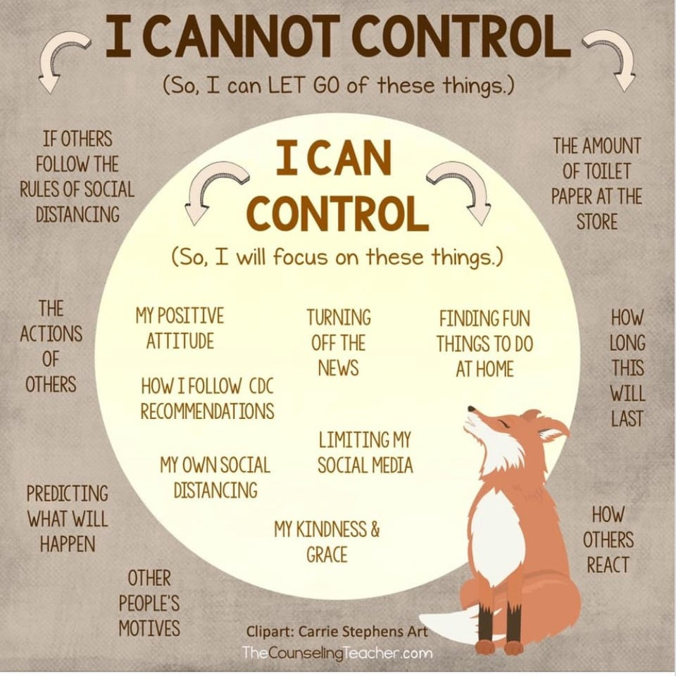
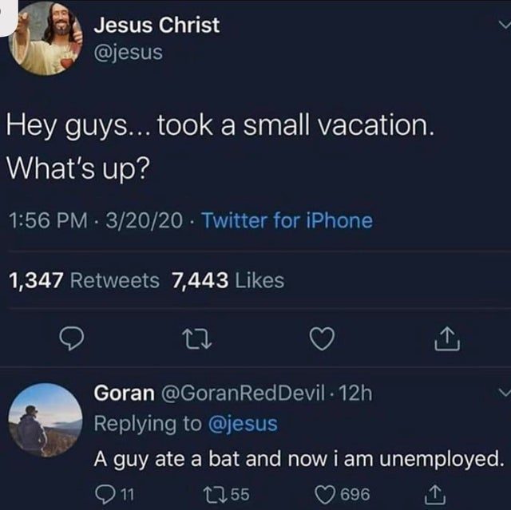
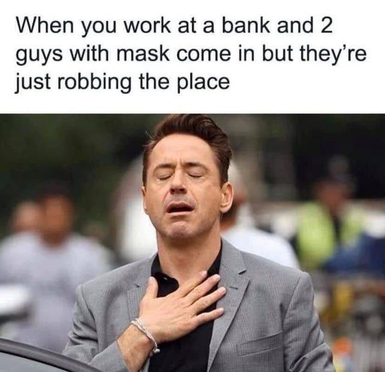

### Mental Health

([image source](https://www.reddit.com/r/coolguides/comments/fm7v7x/guide_to_what_you_can_and_cannot_control_during/), thanks Jane!)

While the intention of this page is to provide factual data that Jason personally finds soothing to understand what's going on better, it's easy to be overwhelmed right now. It is very important to be vigilant and cautious while all of this is going on, but it's also very important to take care of yourself, be it through hobbies, memes, or anything else. And, of course a healthy diet, fresh air, good sleep and exercise are always incredible aids to mental health.

If you're struggling to find something to do rather than constantly refresh the news, consider these resources:

If your gym is closed, none of the [shelter in place](https://www.thecut.com/2020/03/what-does-shelter-in-place-mean.html) plans at this point ban taking a walk or jog outside, though be warned, <strong>in many states the state and city parks are closed, so stick to your neighborhood streets</strong>, and remember to socially distance yourself as you exercise. If lifting weights is more your thing, consider yoga, or plain old [calisthenics](https://www.google.com/search?q=calisthenics). There's a reason the United States physical education classes promote calesthenics - it works. Thanks, Nick, for that life advice!

**More Mental Health Resources**

 * [r/portland's Coronavirus Mental Health Megathread VI](https://www.reddit.com/r/Portland/comments/flk515/mental_health_rportland_covid19_coronavirus/)
 * [r/AskReddit Good internet Rabbit Holes to fall into during this time of quarantine?](https://www.reddit.com/r/AskReddit/comments/fnglbl/what_are_some_good_internet_rabbit_holes_to_fall/)
 * [The School of Life's youtube channel](https://www.youtube.com/user/schooloflifechannel)

**Fun Activities**

 * [Chrome Extension adds chat to watching Netflix movies w/ friends](https://tech.slashdot.org/story/20/03/22/017212/netflix-party-a-new-chrome-extension-adds-chat-panes-to-movies?utm_source=rss1.0mainlinkanon&utm_medium=feed)
 * There's a [24/7 Nine Inch Nails Live Stream](https://www.reddit.com/r/nin/comments/fl1ow6/247_nin_live_stream/) channel someone setup if you're a fan.
 
**Memes**

If you have a **really** NSFW dark sense of humor [r/CoronavirusMemes](https://www.reddit.com/r/CoronavirusMemes/) is incredible right now. Here are some sample Images From r/CoronavirusMemes, if these make you laugh, check it out. If they offend you, definitely **DO NOT** check it out:

If you like those memes, there's also [my 'funny' multireddit feed](https://www.reddit.com/user/ojfs/m/funny/), which also has a *lot of very dark humor* subreddits in it.

However, if dark humor isn't your speed, here are some lighter-hearted meme stashes:

* [pakalupapitocamel's instagram](https://www.instagram.com/pakalupapitocamel/)
* [middle class fancy's instagram](https://www.instagram.com/middleclassfancy/)
* [unnecessary inventions](https://www.instagram.com/unnecessaryinventions/)
* [the big 4 accountant instagram](https://www.instagram.com/thebig4accountant/)
* [consulting humor instagram](https://www.instagram.com/consultinghumor/)
* [My Pets multireddit](https://www.reddit.com/user/ojfs/m/pets/)
* [My Soothing multireddit](https://www.reddit.com/user/ojfs/m/soothing/), especially [r/oddlysatisfying](https://www.reddit.com/r/oddlysatisfying/), [r/powerwashingporn](https://www.reddit.com/r/powerwashingporn/), [r/CozyPlaces](https://www.reddit.com/r/CozyPlaces/), and [r/OrganizationPorn](https://www.reddit.com/r/OrganizationPorn/).

**Silver Linings**

* [Good things happening with covid-19 : Less pollution, altruism, working from home, etc.](https://www.reddit.com/r/Coronavirus/comments/flnfl3/good_things_happening_with_covid19_less_pollution/)

